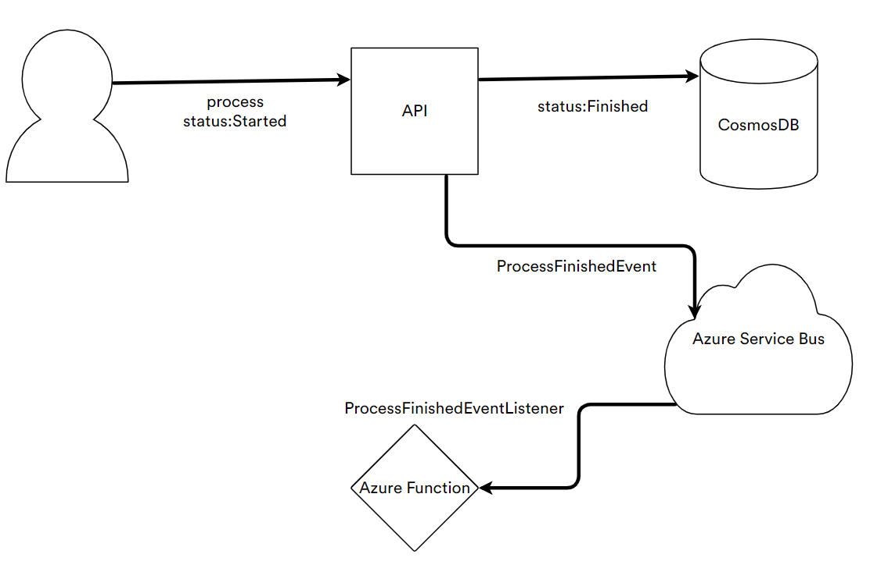

# Clean Architecture Template

This is an example template if you want to implement clean architecture structure in ASP.NET CORE 5.0. It also includes Azure Service Bus, Application Insights and Azure Functions V3.
## Project Structure
- CleanArchitecture.API
- CleanArchitecture.Application
- CleanArchitecture.Domain
- CleanArchitecture.Infrastructure
- CleanArchitecture.Function

## Overview
### Domain
Domain layer contains aggregate roots, value objects, domain exceptions, entities, domain events and repository abstractions.
### Application
Application layer contains use cases like commands and queries. It also includes service exceptions, service abstractions.
### Infrastructure
Infrastructure layer contains classes for accessing external resources. It should also implement abstractions that defined Domain and Application layers.
### Function
This layer contains classes for event listeners. Connected to Azure Service Bus queues.

## Technologies
- ASP.NET Core 5.0 & Clean Architecture & CQRS
- MediatR, FluentValidation, AutoMapper, Swagger, Api Versioning, Dapper
- Azure Service Bus, Azure Functions, Azure Application Insights
- NUnit, FluentAssertions, Moq