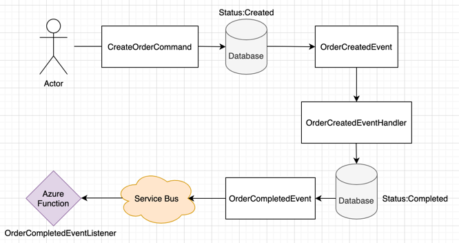

# Clean Architecture Template

This is a example template to implement clean architecture with ASP.NET Core in .Net 5.0. It also includes Azure Service Bus, CosmosDB, Application Insights and Azure Functions V3.
## Project Structure
- CleanArchitecture.API
- CleanArchitecture.Application
- CleanArchitecture.Domain
- CleanArchitecture.Infrastructure
- CleanArchitecture.Function

## Overview
### Domain
This will contain aggregate roots, value objects, exceptions, events.
### Application
This layer defines interfaces that are implemented by outside layers. This layer also contains all application logic.
### Infrastructure
This layer contains classes for accessing external resources. Should be based on interfaces defined within the application layer.
### Function
This layer contains classes for event listeners. Connected to Azure Service Bus queues. 

## Technologies
- ASP.NET 5.0
- MediatR, FluentValidation
- Azure Service Bus, Functions, Application Insights, CosmosDB
- Clean Architecture, CQRS
- NUnit, FluentAssertions, Moq